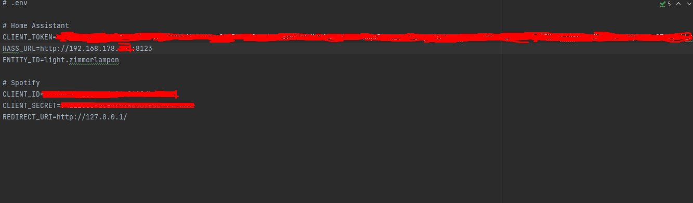
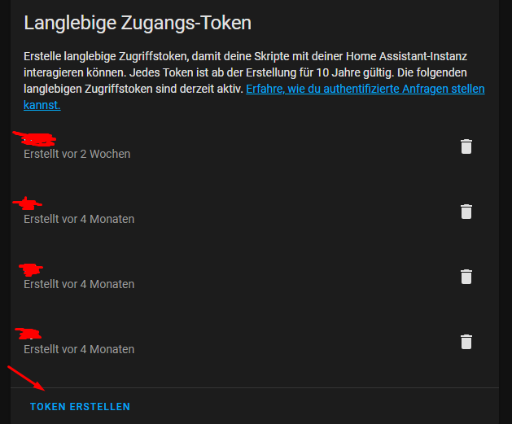

# Spotify lightshow with HomeAssistant

This project is an attempt to visualize songs from spotify by changing the color of one/several lights via Home Assistant

## How to use 
1. Clone repository via `git clone https://github.com/YoshiiPlayzz/spotify_light_show.git`
2. Install all requirements via
``pip install -r requirements.txt``
3. Create new file ``.env`` 
4. Create a "Long living access-token" in Home Assistant profile tab and save in`.env` file as `CLIENT_TOKEN`  
5. Create spotify credentials and save client id as ``CLIENT_ID``, client secret as `CLIENT_SECRET` and the redirect uri as `REDIRECT_URI` (if project is hosted local http://127.0.0.1/)
6. Enter the entity or group id of the lamp you would like to visualize the songs as ``ENTITY_ID`` in `.env`
7. Start the program with `python3 main.py`
8. Enjoy the lightshow!

***Note**: the lightshow is currently not working 100% as intended! especially when you pause the spotify stream and restart it. in this case restart the program and it should work eventually again*